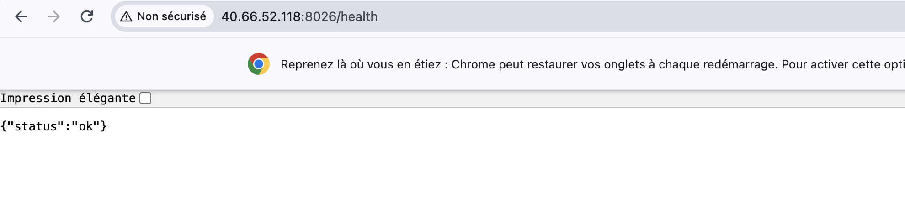
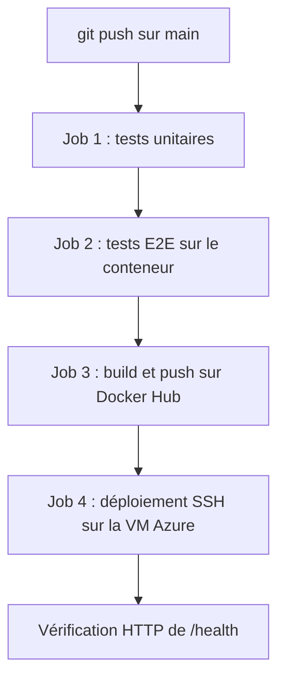

# myapp – API Flask avec CI/CD vers une VM Azure

API Flask conteneurisée avec Docker, testée, publiée sur Docker Hub et déployée automatiquement sur une VM Azure grâce à GitHub Actions.

## Endpoints

| Méthode | Route | Description |
|---|---|---|
| GET | `/health` | Vérification de l'état : renvoie `{"status": "ok"}` |
| GET | `/who` | Renvoie mon prénom et mon nom |
| GET | `/tasks` | Liste les tâches |
| POST | `/tasks` | Crée une tâche (`{"title": "..."}`) |

## Application déployée

L'application est accessible sur l'IP publique de la VM Azure, sur le port 8026 :
`http://40.66.52.118:8026/health`



## Lancer le projet en local

```bash
python -m venv .venv
source .venv/bin/activate          # Windows : .venv\Scripts\activate
pip install -r requirements.txt
python app.py                      # http://localhost:8080
```

Tests :

```bash
python -m pytest tests/unit        # tests unitaires
python -m pytest tests/e2e         # tests E2E (l'API doit être lancée)
```

Avec Docker :

```bash
docker build -t myapp .
docker run -d -p 8080:8080 myapp
```

## Comment le déploiement est déclenché

Le déploiement est entièrement automatique : un simple `git push` sur la branche `main` déclenche le workflow `.github/workflows/ci-cd.yml`. Aucune action manuelle n'est nécessaire après le push. Le workflow peut aussi être relancé depuis l'onglet Actions (bouton « Run workflow »).

## Fonctionnement du pipeline



Les jobs s'enchaînent avec `needs` : si l'un d'eux échoue, les suivants ne sont pas exécutés. Aucune image cassée n'est donc publiée ni déployée.

**Job 1 – Tests unitaires.** Installation de Python et des dépendances, puis `python -m pytest tests/unit`. Chaque route est testée isolément avec le client de test Flask.

**Job 2 – Tests E2E.** Construction de l'image Docker, lancement du conteneur, attente que `/health` réponde, puis `python -m pytest tests/e2e`. Les tests envoient de vraies requêtes HTTP : disponibilité de l'application, `/who`, et un parcours complet de création puis de lecture d'une tâche. On teste ainsi exactement l'image qui sera déployée.

**Job 3 – Build et push.** Connexion à Docker Hub, puis construction et publication de l'image avec deux tags : `latest` et le SHA du commit.

**Job 4 – Déploiement.** Connexion SSH à la VM avec une clé dédiée, `docker pull` de l'image correspondant au commit, remplacement du conteneur, puis vérification depuis l'extérieur que `/health` et `/who` répondent.

## Choix techniques

**Flask et Gunicorn.** Flask pour sa simplicité. Dans le conteneur, l'application est servie par Gunicorn, un serveur adapté à la production, contrairement au serveur de développement de Flask. Gunicorn tourne avec un seul worker car les tâches sont stockées en mémoire.

**Image Docker.** Basée sur `python:3.14-slim` pour rester légère. L'application tourne avec un utilisateur non-root, et un `HEALTHCHECK` Docker interroge `/health` régulièrement.

**Ports.** L'application écoute sur le port 8080 dans le conteneur. La VM étant partagée entre plusieurs étudiants, le port 8026 qui m'est attribué est relié au port 8080 du conteneur (`-p 8026:8080`).

**Tags par SHA.** Chaque image est taguée avec le SHA du commit, ce qui permet de savoir précisément quelle version tourne et de revenir à une version antérieure. C'est ce tag qui est déployé, plutôt que `latest`.

**Déploiement idempotent.** Le conteneur porte un nom fixe et unique sur la VM. Le déploiement télécharge d'abord la nouvelle image, supprime l'ancien conteneur s'il existe (`docker rm -f`), puis en lance un nouveau. Relancer le workflow ne crée donc jamais de second conteneur. Si le téléchargement échoue, le script s'arrête avant la suppression et l'ancienne version reste en ligne. L'option `--restart unless-stopped` relance le conteneur après un plantage ou un redémarrage de la VM.

**Sécurité.** Aucun identifiant n'apparaît dans le dépôt. Les informations sensibles sont stockées dans les GitHub Secrets et masquées dans les logs :

| Secret | Rôle |
|---|---|
| `DOCKERHUB_USERNAME` | nom d'utilisateur Docker Hub |
| `DOCKERHUB_TOKEN` | token d'accès Docker Hub |
| `SSH_PRIVATE_KEY` | clé privée SSH dédiée au déploiement |
| `VM_HOST` | adresse IP de la VM |
| `VM_USER` | utilisateur SSH de la VM |

Le workflow n'a que le droit de lecture sur le dépôt (`permissions: contents: read`).

## Structure du projet

```
├── .github/workflows/ci-cd.yml
├── docs/vm-health.png
├── tests/
│   ├── unit/test_app.py
│   └── e2e/test_e2e.py
├── app.py
├── requirements.txt
├── Dockerfile
├── .dockerignore
└── README.md
```
